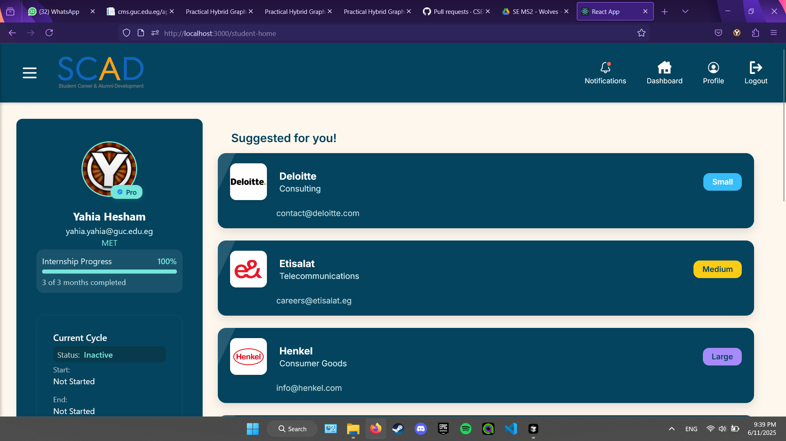
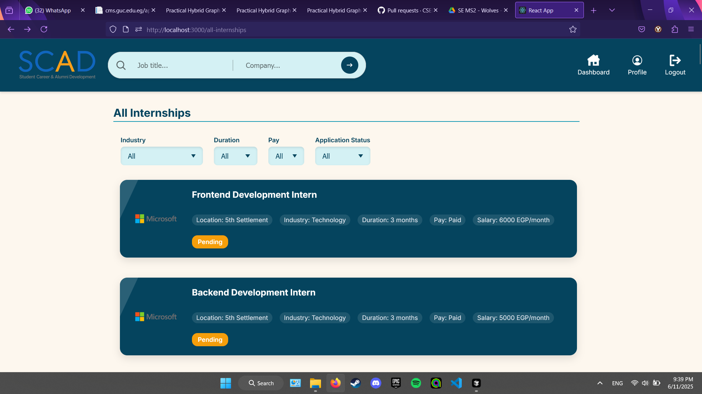
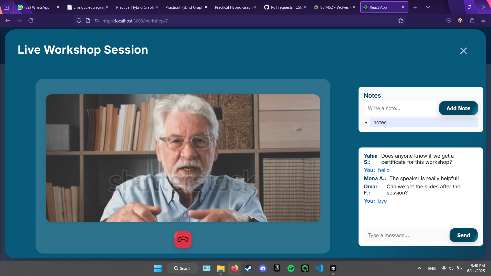
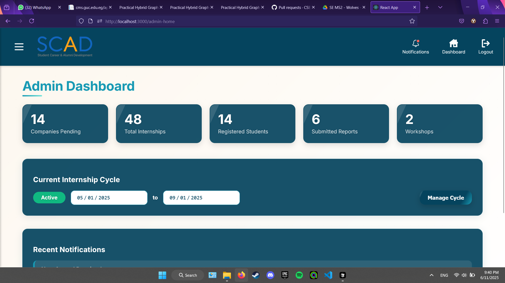

# Wolves - Student Internship Management System

Wolves is a comprehensive web application designed to streamline the internship management process for students, companies, and educational institutions. The platform facilitates internship applications, workshop management, and provides a seamless experience for all stakeholders involved in the internship ecosystem.

## 📸 Screenshots & Demo

[](https://drive.google.com/file/d/1a91Av27RVmSw3Cu35nDWYFga0IOgCX7Q/view?usp=drive_link)

### Key Features Showcase





## 🌟 Features

### For Students
- **Dashboard**
  - Overview of applications, workshops, and appointments
  - Quick access to upcoming events and deadlines
  - Real-time notifications for application updates
  - Performance metrics and progress tracking

- **Internship Management**
  - Browse and filter available internships
  - Detailed internship listings with company information
  - One-click application submission
  - Track application status and receive feedback
  - Download certificates and evaluation reports
  - View internship history and performance metrics

- **Workshop System**
  - Browse and register for upcoming workshops
  - Interactive live workshop sessions with real-time chat
  - Access workshop recordings and materials
  - Take and save notes during sessions
  - Rate workshops and provide detailed feedback
  - Download workshop certificates and completion records

- **Appointment System**
  - Schedule meetings with faculty advisors
  - View and manage appointment calendar
  - Receive email notifications for upcoming appointments
  - Track appointment history and meeting notes

### For Companies
- **Internship Management**
  - Create and manage detailed internship listings
  - Set application requirements and deadlines
  - Review and filter applications
  - Provide feedback and status updates
  - Track intern performance and evaluations
  - Generate internship reports and analytics


### For Educational Institutions
- **Student Management**
  - Comprehensive student profiles and progress tracking
  - Monitor internship applications and outcomes
  - Track workshop participation and performance
  - Generate student performance reports

- **Workshop Administration**
  - Create and schedule workshops
  - Manage workshop registrations
  - Track attendance and participation
  - Generate workshop reports and analytics

- **Reporting System**
  - Generate detailed internship reports
  - Track student performance metrics
  - Monitor company engagement
  - Export data for analysis

## 🛠️ Technology Stack

- **Frontend**: React.js with modern hooks and context API
- **Routing**: React Router DOM v7
- **PDF Generation**: jsPDF for certificates and reports
- **Testing**: Jest and React Testing Library
- **Styling**: CSS3 with modern features and responsive design
- **State Management**: React Context API
- **UI Components**: Custom-built components with modern design patterns

## 🚀 Getting Started

### Prerequisites
- Node.js (v14 or higher)
- npm (v6 or higher)

### Installation

1. Clone the repository:
```bash
git clone https://github.com/yourusername/wolves.git
cd wolves
```

2. Install dependencies:
```bash
npm install
```

3. Start the development server:
```bash
npm start
```

The application will be available at `http://localhost:3000`

## 📁 Project Structure

```
wolves-ms2/
├── src/
│   ├── components/     # Reusable UI components
│   │   ├── modals/    # Modal components
│   │   ├── forms/     # Form components
│   │   └── common/    # Common UI elements
│   ├── pages/         # Page components
│   │   ├── student/   # Student pages
│   │   ├── company/   # Company pages
│   │   └── admin/     # Admin pages
│   ├── context/       # React context providers
│   ├── data/          # Mock data and JSON files
│   ├── assets/        # Images, icons, and other static files
│   └── styles/        # Global styles and CSS files
├── public/            # Static files
└── package.json       # Project dependencies and scripts
```


## 👥 Authors

- Yahia Hesham Yahia

